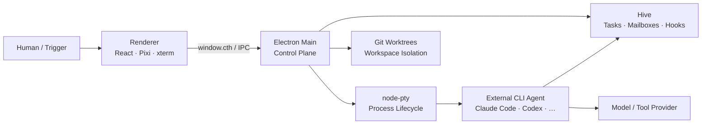

# Learn Munder Difflin

一份面向二次开发者、由源码证据驱动的 Munder Difflin 交互式架构学习站。中文优先，支持中英切换、深浅主题、章节搜索、响应式导航、固定 commit 源码卡片，以及可逐步检查输入/输出/源码的端到端调用链。

> 分析基线：[`chaitanyagiri/munder-difflin@956bfb4c`](https://github.com/chaitanyagiri/munder-difflin/tree/956bfb4cff1af97f9cf29b9ce489ae69a5774843)，获取于 2026-08-30。所有源码链接固定到该 commit，不会随 upstream `main` 漂移。

## 架构结论

Munder Difflin 不是模型推理 Runtime，也不在进程内实现 agent loop。它是一个 local-first 多 CLI Agent **harness + orchestration layer + control plane + visualization shell**：

- Claude Code、Codex 等外部 CLI 进程拥有模型连接、tool loop、provider session 与大部分上下文管理。
- Electron Main 拥有进程、PTY、文件系统、Git、SQLite、Hive 协议和外围网络服务的权限。
- Preload 通过 `window.cth` 提供窄 IPC 能力面；sandboxed Renderer 不直接获得 Node 权限。
- Hive 用 registry、task ledger、agent directories、mailbox、hook、poll router 和安全控制器协调多个真实 CLI 进程。
- Office / Kanban / terminal UI 消费真实 PTY 与 hook 事件，是控制与可视化产品层，不是编排正确性的来源。



## 内容覆盖

- 产品定位与系统边界
- Electron Main / Preload / Renderer 权限分层
- `AddAgentModal → spawnAgentCore → HiveManager → PtyManager → external CLI` 启动链
- Hive task、mailbox、router、hook、safe delivery、breaker 与 Closing Time
- node-pty 跨平台 command resolution、Windows shim、session identity 与进程树回收
- SQLite / config / roster / Hive files / runtime memory / CLI storage 五层状态权威
- Git worktree 隔离、dirty/ahead 保全与 `gh` adapter 边界
- Realtime voice、Slack/Webhook/tunnel、本地 OTLP、PostHog 和 updater
- 12 个源码域、8 条端到端调用链、8 级学习路线与企业平台复用判断

## 本地运行

要求 Node.js `>=22.13.0`。

```bash
npm install
npm run dev
```

打开 `http://localhost:3000`。

验证命令：

```bash
npm run typecheck
npm run lint
npm test
npm run build
```

## 资料入口

- [源码快照与分析口径](docs/source-snapshot.md)
- [架构分析笔记](docs/architecture-notes.md)
- [机器可读源码索引](docs/source-index.json)
- [上游仓库](https://github.com/chaitanyagiri/munder-difflin)

## 实现

Next.js 16、React 19、TypeScript 与原生 CSS。站点没有运行时后端或数据库依赖，可直接部署到 Vercel。交互图使用语义化 HTML/CSS 实现，移动端可以横向浏览长调用链。

## 声明

本项目用于源码学习，不是 Munder Difflin 官方文档。图标与视觉系统均为本项目原创实现，没有复制上游或参考项目素材。
